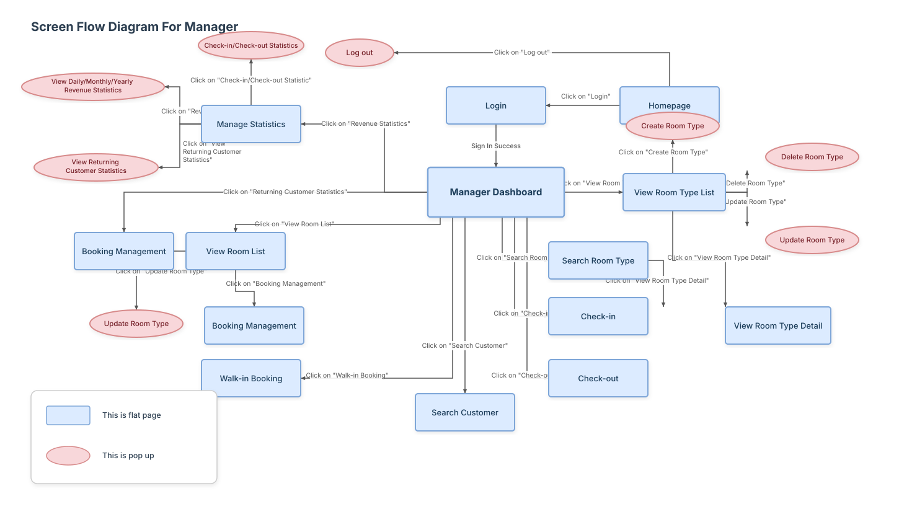

# Screen Flow Diagram For Manager

This screen flow diagram models the system navigation and screen states for the **Manager** role, detailing page flows (flat pages) and popup/modal windows.

## Diagram Overview

Below is the rendered vector diagram representing the screen flows:

---

## Screen Flow Elements

### Core Path
1. **Homepage** (Flat Page) $\rightarrow$ Click on "Login" $\rightarrow$ **Login** (Flat Page)
2. **Login** $\rightarrow$ Sign In Success $\rightarrow$ **Manager Dashboard** (Flat Page)
3. **Homepage** $\rightarrow$ Click on "Log out" $\rightarrow$ **Log out** (Popup)

### Manager Dashboard Branches

#### 1. Statistics
- **Manager Dashboard** $\rightarrow$ Click on "Revenue Statistics" $\rightarrow$ **Manage Statistics** (Flat Page)
- **Manage Statistics** $\rightarrow$ Click on "Check-in/Check-out Statistic" $\rightarrow$ **Check-in/Check-out Statistics** (Popup)
- **Manage Statistics** $\rightarrow$ Click on "Revenue Statistics" $\rightarrow$ **View Daily/Monthly/Yearly Revenue Statistics** (Popup)
- **Manage Statistics** $\rightarrow$ Click on "View Returning Customer Statistics" $\rightarrow$ **View Returning Customer Statistics** (Popup)

#### 2. Room Type
- **Manager Dashboard** $\rightarrow$ Click on "View Room Type List" $\rightarrow$ **View Room Type List** (Flat Page)
- **View Room Type List** $\rightarrow$ Click on "Create Room Type" $\rightarrow$ **Create Room Type** (Popup)
- **View Room Type List** $\rightarrow$ Click on "Delete Room Type" $\rightarrow$ **Delete Room Type** (Popup)
- **View Room Type List** $\rightarrow$ Click on "Update Room Type" $\rightarrow$ **Update Room Type** (Popup)
- **View Room Type List** $\rightarrow$ Click on "View Room Type Detail" $\rightarrow$ **View Room Type Detail** (Flat Page)

#### 3. Search Room & Check-in/out
- **Manager Dashboard** $\rightarrow$ Click on "Search Room Type" $\rightarrow$ **Search Room Type** (Flat Page)
- **Search Room Type** $\rightarrow$ Click on "View Room Type Detail" $\rightarrow$ **View Room Type Detail** (Flat Page)
- **Manager Dashboard** $\rightarrow$ Click on "Check-in" $\rightarrow$ **Check-in** (Flat Page)
- **Manager Dashboard** $\rightarrow$ Click on "Check-out" $\rightarrow$ **Check-out** (Flat Page)

#### 4. Booking & Customers
- **Manager Dashboard** $\rightarrow$ Click on "View Room List" $\rightarrow$ **View Room List** (Flat Page)
- **View Room List** $\rightarrow$ Click on "Update Room Type" $\rightarrow$ **Update Room Type** (Popup)
- **View Room List** $\rightarrow$ Click on "Booking Management" $\rightarrow$ **Booking Management** (Flat Page)
- **Manager Dashboard** $\rightarrow$ Click on "Returning Customer Statistics" $\rightarrow$ **Booking Management** (Flat Page)
- **Manager Dashboard** $\rightarrow$ Click on "Walk-in Booking" $\rightarrow$ **Walk-in Booking** (Flat Page)
- **Manager Dashboard** $\rightarrow$ Click on "Search Customer" $\rightarrow$ **Search Customer** (Flat Page)

---

## Legend & Styles

- **Flat Page**: Light Blue (`#DCEBFF`) with blue border (`#7EA6D8`). Used for full-page screens.
- **Popup Window**: Light Pink (`#F8D7DA`) with pink border (`#D78A8A`). Used for overlays/modals.
